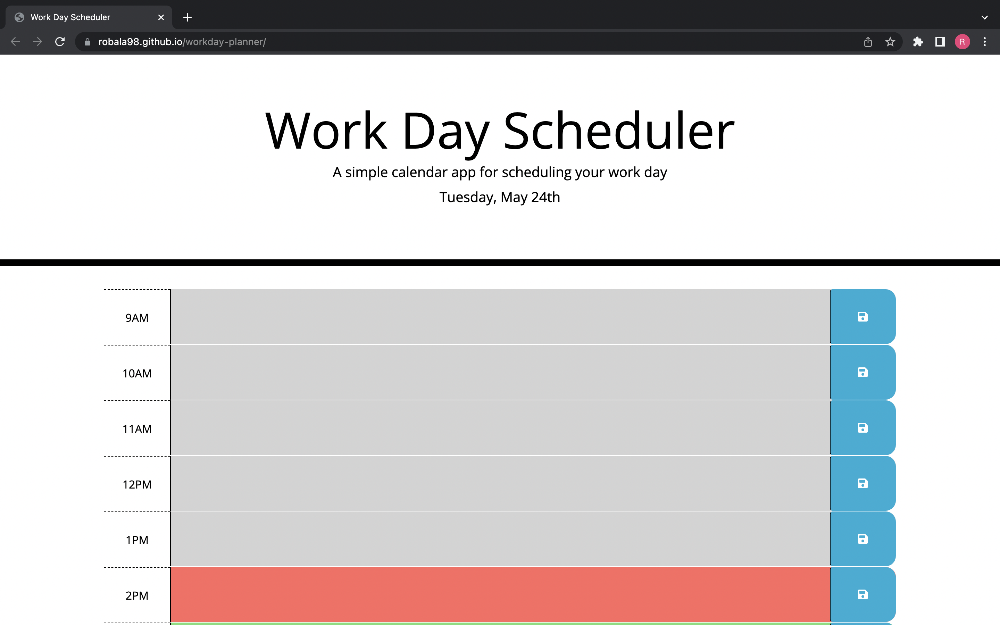

# workday-planner

## Installation/Usage

Clone the repo and open the index.html in the browser.

## Description

This application allows the user to save tasks in time blocks in order to keep track of a schedule.

## Screenshot

## Links

